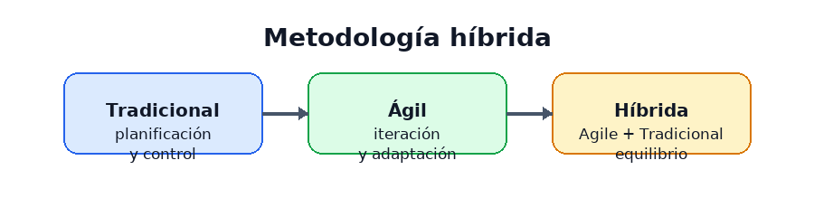
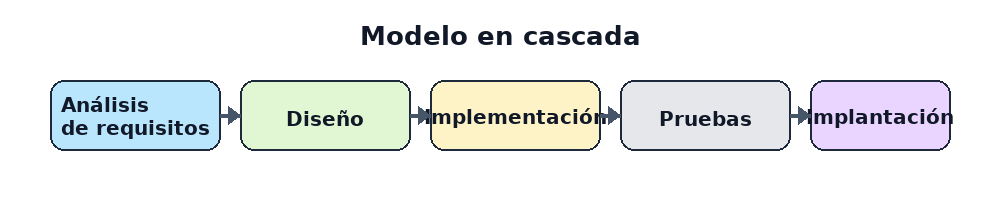
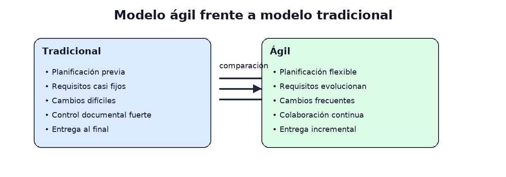

# UD2. Metodologías de proyectos

## Teórico-Práctica

### Estudio de metodologías de gestión de proyectos (ágiles, tradicionales y híbridas), roles, reuniones, planificación y control del progreso.

---

## 1. Introducción

La gestión de proyectos es la disciplina que permite organizar, coordinar y controlar los recursos, tiempos, riesgos y entregables necesarios para alcanzar un objetivo concreto. En la práctica, cada proyecto tiene características distintas y requiere una metodología apropiada a su contexto, complejidad, incertidumbre y urgencia.

A lo largo de la historia, dos grandes enfoques han predominado:

- Metodologías tradicionales o predictivas
- Metodologías ágiles o adaptativas

Además, en la actualidad muchas organizaciones utilizan modelos híbridos que combinan elementos de ambos enfoques para equilibrar planificación, flexibilidad y control.

---

## 2. Metodologías tradicionales

Las metodologías tradicionales, también llamadas secuenciales o predictivas, se basan en una planificación inicial exhaustiva y en una ejecución ordenada de fases. Su punto fuerte es la previsibilidad y el control de alcance, coste y tiempos cuando los requisitos son conocidos desde el principio.

### 2.1. Modelo en cascada

El modelo en cascada divide el proyecto en fases consecutivas y cada etapa se encadena con la siguiente mediante una secuencia lógica y progresiva.

1. Análisis de requisitos
2. Diseño
3. Implementación
4. Pruebas
5. Implantación y mantenimiento

Cada fase debe completarse antes de pasar a la siguiente. Es útil cuando el proyecto es estable, el alcance está bien definido y los cambios son muy costosos.

### 2.2. Ventajas y limitaciones

Ventajas:

- Planificación detallada desde el inicio
- Documentación clara y estructurada
- Fácil trazabilidad de decisiones
- Adecuado para proyectos con requisitos estables

Limitaciones:

- Poca flexibilidad ante cambios
- Dificultad para responder a requisitos no previstos
- Riesgo alto si se detectan errores tarde
- El cliente ve resultados solo al final

---

## 3. Metodologías ágiles

Las metodologías ágiles surgieron como respuesta a entornos de cambio constante y alta incertidumbre. Priorizan la entrega incremental, la colaboración con el cliente y la posibilidad de ajustar el plan durante el proyecto.

### 3.1. Principios ágiles

Los principios del enfoque ágil se centran en:

- Entregar valor de forma incremental
- Responder a cambios en lugar de seguir un plan rígido
- Fomentar la comunicación continua
- Trabajar con equipos autoorganizados
- Revisar y ajustar el producto de forma frecuente

### 3.2. Scrum

Scrum es una de las metodologías ágiles más utilizadas. Se organiza en iteraciones llamadas sprints, normalmente de 1 a 4 semanas, y se centra en entregas funcionales y revisiones periódicas.

En un proyecto de ASIR enfocado en DevOps y SysAdmin, Scrum puede servir para gestionar tareas como desplegar servicios, automatizar copias de seguridad, instalar servidores, documentar infraestructura, corregir incidencias o preparar entornos de pruebas. El equipo no trabaja solo con código, sino también con configuración, automatización y mantenimiento de sistemas.

Las herramientas más habituales para coordinar este tipo de trabajo son Trello y Jira:

- Trello: ayuda a visualizar tareas en tableros tipo Kanban, ideal para asignar trabajos rápidos, incidencias y seguimiento de tareas diarias.
- Jira: es muy útil para gestionar historias de usuario, sprints, backlog, incidencias y métricas de entrega en equipos con más estructura de proyecto.

#### Roles clave en Scrum y su función principal

| Rol | Función principal |
|---|---|
| Product Owner | Define la prioridad del producto y representa las necesidades del cliente o del usuario final. |
| Scrum Master | Facilita el proceso, elimina bloqueos y ayuda al equipo a seguir la metodología sin perder calidad ni ritmo. |
| Development Team | Diseña, implementa, prueba y entrega la solución, incluyendo automatización, despliegues y configuración. |

En un proyecto de DevOps/SysAdmin, el Development Team puede incluir roles concretos como administrador de sistemas, analista de redes, desarrollador de automatización, responsable de despliegue y soporte técnico. Aunque la responsabilidad es compartida, cada miembro aporta especialización distinta al servicio.

#### Artefactos principales

- Product Backlog: lista priorizada de requisitos y mejoras.
- Sprint Backlog: trabajo seleccionado para el sprint.
- Increment: resultado usable al final del sprint.

#### Reuniones clave en Scrum

- Sprint Planning: planifica el trabajo del siguiente sprint.
- Daily Scrum: reunión breve diaria para sincronizar el equipo.
- Sprint Review: se presenta el trabajo realizado y se recibe feedback.
- Sprint Retrospective: análisis de lo que ha funcionado y cómo mejorar.

### 3.3. Kanban

Kanban se basa en visualizar el flujo de trabajo mediante un tablero con columnas como “Por hacer”, “En proceso” y “Hecho”. Se centra en limitar el trabajo en curso y mejorar el flujo continuo de entrega.

### 3.4. Ventajas y limitaciones de Agile

Ventajas:

- Flexibilidad ante cambios
- Mayor colaboración y adaptabilidad
- Entregas frecuentes de valor
- Mejora continua

Limitaciones:

- Requiere implicación constante del cliente
- Puede resultar caótico sin disciplina y gobernanza
- No siempre es adecuado para proyectos altamente regulados

---

## 4. Metodologías híbridas

Las metodologías híbridas mezclan elementos de planificación tradicional y enfoques ágiles. Se utilizan cuando el proyecto tiene parte de requisitos estables y otra parte cambiante, o cuando la organización necesita control documental junto a entregas iterativas.

### 4.1. ¿Cuándo conviene una metodología híbrida?

Es recomendable en proyectos donde:

- Hay regulación o auditoría externa
- Existen requisitos fijos y otros emergentes
- Se requiere documentación formal, pero también rapidez de entrega
- El equipo necesita combinar gobernanza con innovación

### 4.2. Ejemplo de enfoque híbrido

Un proyecto puede usar:

- una planificación inicial del alcance y presupuesto,
- entregas iterativas por sprints,
- reuniones de revisión periódicas,
- control de riesgos y documentación formal,
- y adaptación continua según el feedback del cliente.

---

## 5. Roles en la gestión de proyectos

Aunque cada metodología define roles distintos, algunas funciones son comunes en casi cualquier proyecto.

### 5.1. Roles principales

- Director/a de proyecto: supervisa objetivos, alcance, cronograma y riesgos.
- Jefe de equipo / coordinador: organiza tareas y recursos del equipo.
- Analista / responsable de requisitos: recoge necesidades y prioriza funcionalidad.
- Desarrollador/a: diseña y construye la solución.
- Tester / QA: valida la calidad y la corrección del producto.
- Cliente / stakeholder: aporta necesidades, validación y feedback.
- DevOps / SysAdmin: automatiza despliegues, gestiona infraestructura, monitorización, seguridad y mantenimiento del entorno.

En un proyecto de ASIR con enfoque DevOps y administración de sistemas, el rol de SysAdmin no es solo “instalar servicios”, sino también garantizar disponibilidad, escalabilidad, seguridad, copias de seguridad y recuperación ante fallos. El rol de DevOps conecta desarrollo e infraestructura para automatizar despliegues y reducir errores manuales.

### 5.2. Importancia del papel del equipo

El éxito de un proyecto depende no solo de la planificación, sino también de la comunicación, la motivación y la colaboración dentro del equipo. Los roles deben estar definidos, pero también es necesario fomentar la cooperación y la responsabilidad compartida.

---

## 6. Reuniones y comunicación

Las reuniones son un elemento clave para la coordinación del proyecto. Su objetivo es facilitar la toma de decisiones, compartir avances y detectar riesgos a tiempo.

### 6.1. Tipos de reuniones

- Reunión inicial o kickoff: presenta objetivos, alcance, responsabilidades y cronograma.
- Reunión de seguimiento: revisa avances, bloqueos y próximos pasos.
- Reunión de planificación: define tareas, prioridades y plazos.
- Reunión de revisión: valida el progreso con el cliente o stakeholders.
- Reunión de retrospectiva: identifica mejoras para el próximo ciclo.

### 6.2. Buenas prácticas

- Mantener reuniones con objetivos claros
- Limitar la duración y el número de asistentes
- Registrar decisiones y compromisos
- Asegurar la participación de todos los implicados
- Documentar riesgos y acciones pendientes

---

## 7. Planificación del proyecto

La planificación es la base de la gestión de proyectos. Consiste en definir qué se hará, quién lo hará, cuándo y con qué recursos.

### 7.1. Elementos clave de la planificación

- Objetivos y alcance
- Tareas y dependencias
- Duración estimada
- Recursos humanos y materiales
- Presupuesto
- Riesgos
- Calendario y hitos

### 7.2. Técnicas de planificación

Algunas técnicas habituales son:

- Diagrama de Gantt
- Diagrama de precedencias o PERT
- WBS (Work Breakdown Structure)
- Historias de usuario y backlog en metodologías ágiles
- Estimaciones por puntos de historia o por tiempos

La planificación debe adaptarse al tipo de proyecto. En entornos estables, un plan detallado puede ser más útil; en entornos inciertos, conviene una planificación adaptable y revisable.

---

## 8. Control del progreso

El control del progreso consiste en comparar el plan previsto con la ejecución real y detectar desviaciones. Es fundamental para corregir problemas antes de que se conviertan en riesgos graves.

### 8.1. Indicadores de seguimiento

- Avance frente al plan
- Tiempo gastado y tiempo previsto
- Coste real y coste estimado
- Calidad de entregables
- Riesgos activos y mitigados
- Cumplimiento de hitos

### 8.2. Herramientas de control

- Tableros de seguimiento
- Informes de estado
- Métricas de productividad
- Gráficos de avance
- Revisión de riesgos y dependencias

### 8.3. Corrección de desviaciones

Cuando el proyecto se desvía, es necesario actuar con rapidez:

- Repriorizar tareas
- Redefinir alcance o tiempos
- Asignar más recursos
- Reducir riesgos
- Comunicar cambios a los stakeholders

---

## 9. Comparativa entre metodologías

| Enfoque | Características principales | Cuándo conviene |
|---|---|---|
| Tradicional | Planificación previa, fases secuenciales, control fuerte | Requisitos estables y poco cambio |
| Ágil | Iteraciones, entrega incremental, colaboración continua | Entornos dinámicos y cambiantes |
| Híbrida | Mezcla de planificación y flexibilidad | Proyectos con requisitos mixtos |

La elección de la metodología depende del contexto, del nivel de incertidumbre, de la necesidad de control y de la forma en que el cliente quiere participar en el proyecto.

---

## 10. Conclusión

La gestión de proyectos no se basa en una única fórmula válida para todos los casos. Cada metodología ofrece ventajas y limitaciones en función de la naturaleza del trabajo, la complejidad del producto y el grado de incertidumbre.

- Las metodologías tradicionales destacan por su control y previsibilidad.
- Las metodologías ágiles se adaptan mejor a entornos cambiantes.
- Las metodologías híbridas buscan equilibrar estructura y flexibilidad.

En cualquier caso, el éxito del proyecto depende de una buena comunicación, una planificación adecuada, un liderazgo claro y un seguimiento constante del progreso. La capacidad de adaptar la metodología al proyecto es, hoy en día, una competencia esencial para cualquier profesional de la gestión.

---

## 11. Bibliografía recomendada

- Agile Manifesto. (2001).
- Schwaber, K. y Sutherland, J. (2017). El Guía Scrum.
- PMI. (2021). Guía del PMBOK.
- Pressman, R. S. (2010). Ingeniería del Software.
- Kerzner, H. (2017). Project Management: A Systems Approach to Planning, Scheduling, and Controlling.

---

## 12. Actividad de reflexión

1. Compara una metodología tradicional y una ágil en un caso práctico de desarrollo de software.
2. Explica qué papel tiene el Product Owner y el Scrum Master en un proyecto Scrum.
3. Describe cómo se planifica un sprint y qué indicadores permiten controlar su progreso.
4. Analiza cuándo es más adecuado un enfoque híbrido en lugar de uno puro.
